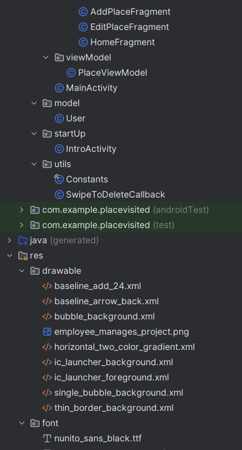
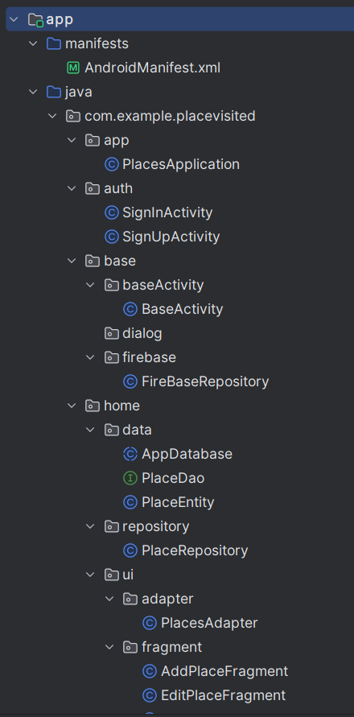

# 📱 Our Awesome Android Project

**👋 Hey there, fellow code enthusiasts!**

Welcome to our cutting-edge Android project! We've poured our passion and expertise into crafting an app that's not just functional, but a showcase of modern Android development prowess. Let's dive into what makes our app stand out!

## 🌟 What Makes Our App Special?

1. **Cutting-Edge Compatibility**: We're ready for the future! Our app runs smoothly on Android versions up to 14.
2. **Data Dynamo**: With Room database integration, we've got your data storage needs covered like a pro.
3. **Silky Smooth Navigation**: Glide through our app effortlessly with our fragment-based navigation system.
4. **CRUD Mastery**: Create, Read, Update, Delete - we've implemented it all with style and efficiency.
5. **Fort Knox Security**: Thanks to Firebase authentication, your data is locked up tighter than a drum.
6. **Responsive UI Magic**: LiveData keeps your UI fresh and up-to-date without breaking a sweat.
7. **Speed Demon**: We've harnessed the power of Threading for lightning-fast database operations.
8. **Architectural Marvel**: Our MVVM architecture is so clean, it squeaks!

## 🛠 Our Tech Arsenal

* **MVVM Architecture**: Keeping our code organized and our developers sane
* **ViewBinding**: Connecting our code to our UI faster than you can say "findViewById"
* **Multi-Thread**: Handling background tasks like a boss
* **LiveData**: Making sure your UI is always in the know
* **Navigation Component**: Guiding users through our app like a GPS for UI
* **Room Database**: For local data storage that's faster than greased lightning
* **Firebase**: Keeping authentication secure and data in sync

## Project structure
|  |  |

## 💡 Our Coding Philosophy

We believe in writing code that's:
* Cleaner than a whistle
* More maintainable than a well-oiled machine
* Efficient enough to make your battery last longer than a marathon
* Organized better than a librarian's bookshelf

## 🚀 What's on the Horizon?

We're always pushing the envelope. Here's what we're excited about:
1. Sprinkling in some UI magic with animations
2. Beefing up our testing to make our app more bulletproof than ever
3. Exploring new Android features to keep our app on the cutting edge

## 🌈 The Cherry on Top

What really sets us apart is our blend of classic and modern. We've got XML layouts for that timeless Android feel, all wrapped up in a structure that's more organized than a neat freak's closet.

We're über proud of what we've built here. It's not just an app; it's a testament to what happens when you combine the latest tech with solid coding practices. We can't wait to hear what you think!

Ready to dive in? Check out our "Getting Started" section below and join us on this exciting Android adventure! 🚀